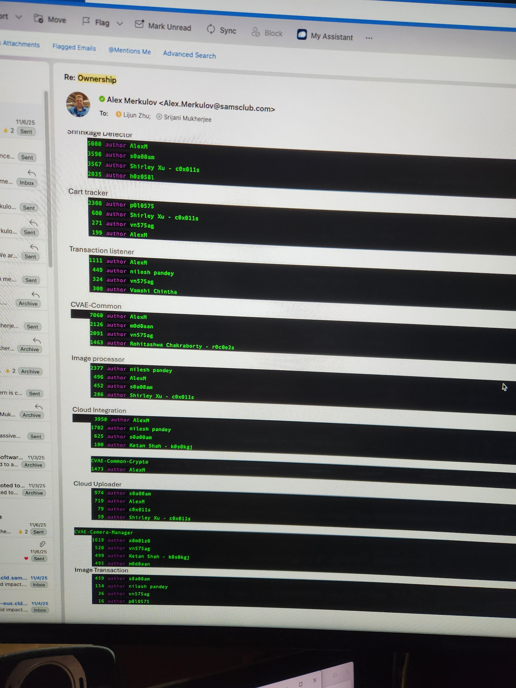
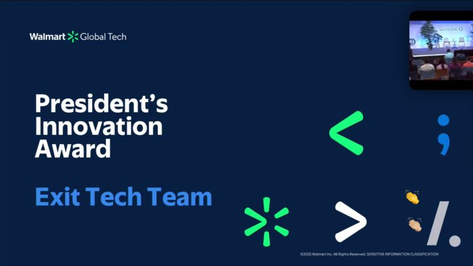
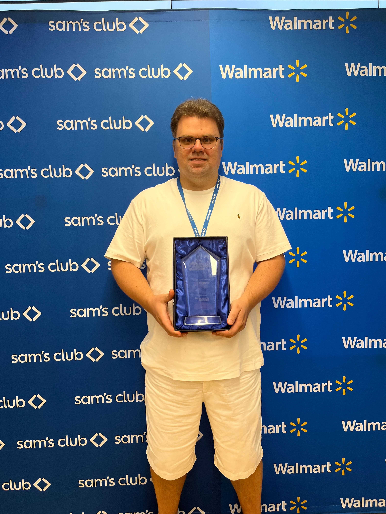
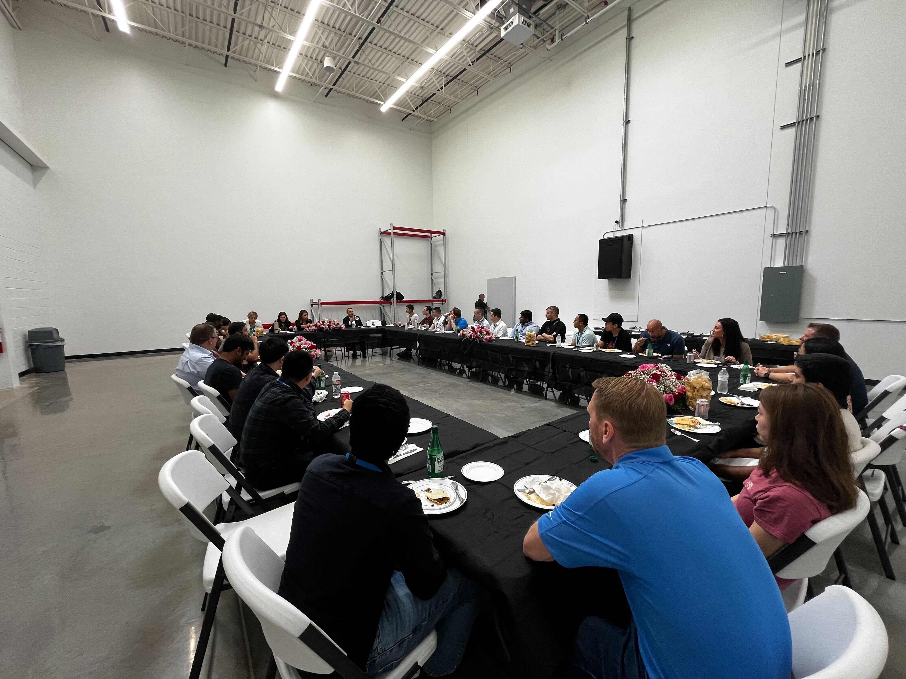
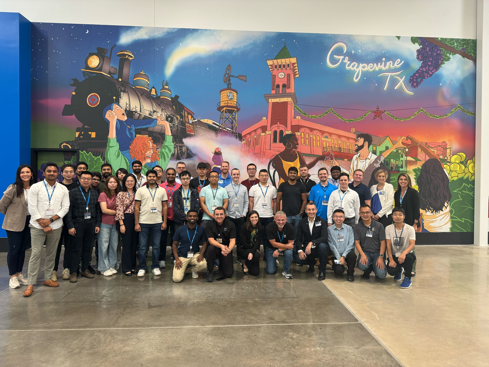

# Alex Merkulov - Walmart

## Goals 2025 — Completed in Q1 & Q2 2025

Manager's summary: These goals reflect Alex's current and recent contributions across RFID basket matching, system optimization and cost reduction, observability improvements, CPH platform integration, cross-team project support, regression testing, and cloud integration maintenance. They cover end-to-end delivery — from design and development through production rollout and operational reliability — demonstrating broad technical ownership and cross-functional collaboration.

**All goals below were completed as real tasks in Q1 & Q2 of 2025.**

[Full Goals Document](AlexMerkulovGoals2025.txt)

1. **RFID Basket Matching Logic** — Design, develop, and roll out the RFID Basket Matching module for improved basket-item mapping accuracy.
2. **System Optimization & Cost Reduction** — Log optimization, Cloud Uploader optimization, Redis LUA integration, secret caching, and edge caching to reduce costs and latency.
3. **Observability & Maintenance** — New performance log categories and Triton Server repo refactor for better visibility and maintainability.
4. **CPH Platform Integration & Data Reliability** — Production topic onboarding, receipt data investigations, and Cosmos DB throttling resolution.
5. **Cross-Team Project Support** — Technical consultation for "Just Unload" project and Terraform deployment issue resolution.
6. **Regression Testing & QA** — Identified and fixed recurring test failures, improved automation efficiency.
7. **Cloud Integration Improvements** — Terminal standardization, Kafka certificate renewals, secondary service bus integration, CTH Kafka migration, and Scout Kafka multi-region fixes.
8. **Leadership & Collaboration** — Consistent cross-functional communication, solutions-oriented contributions, and on-time quality deliverables.

## Receipt Latency Decrease - September 2024

Receipt latency significantly decreased after optimization work completed in September 2024.

## Awards and Recognition

## Documents

- [Award Alex Merkulov - Sept 2024](Award%20Alex%20Merkulov%20-%20Sept%202024.pdf)
